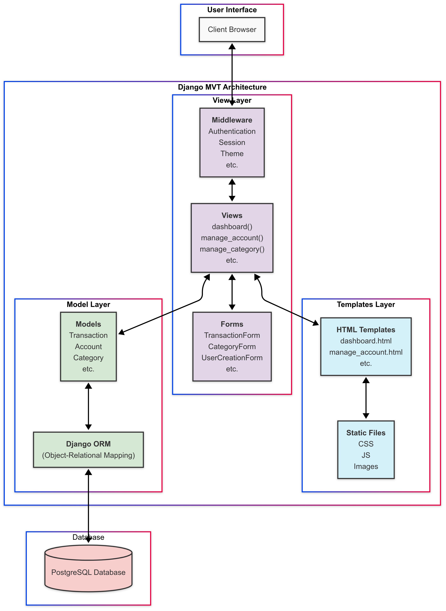
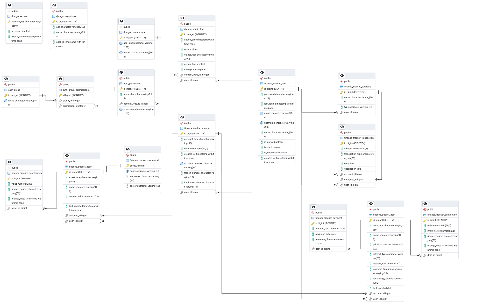

# personal-finance-tracker
A simple personal finance tracking application built with Django and Python.

## Project Overview

This project aims to help users track their income and expenses easily. The exact features and implementation details are still being worked out, but the goal is to provide a straightforward and useful tool for managing personal finances.

Tech Stack
- Backend: Django (Python)
- Database: PostgreSQL (tentative)
- Frontend: TBD

## Architecture

The Personal Finance Tracker follows Django's MVT (Model-View-Template) architecture:



1. Templates Layer:
- HTML templates with Django template language
- Static files including bootstrap themes, CSS, JavaScript, and custom components
2. View Layer:
- View functions that process requests and generate responses
- Forms for data validation and processing
- Middleware for authentication, session management, and user themes
3. Model Layer:
- Django models representing database entities
- Object-Relational Mapping (ORM) for database interactions
- Business logic for financial data processing
4. Database Layer:
- PostgreSQL database for persisting application data

### Data Flow
1. The client browser sends a request to the server
2. Middleware processes the request (authenticating the user, session management)
3. The appropriate view function is called based on the URL
4. The view interacts with models to retrieve or update data
5. Models use Django's ORM to interact with the PostgreSQL database
6. The view renders a template with the data
7. The response is returned to the client browser

## Database Structure

The Personal Finance Tracker uses a relational database model to store financial information. The database schema is designed to efficiently track transactions, categories, accounts, and user data.

### Entity Relationship Diagram

The following diagram shows the relationships between the main entities in our database:



### Key Entities and Relationships

- **User**: Central entity that owns all personal financial data
- **Transaction**: Records of financial activities (income or expenses)
- **Category**: Classification system for transactions (e.g., Groceries, Utilities, Salary)
- **Account**: Financial accounts like checking, savings, or credit cards

Note: Other tables in the database are either generated by Django or do not have functionality tied to them yet.

## Installation (Work in Progress)
1. Clone the repository and go into the person-finance-tracker directory:
```
git clone https://github.com/ethanondzik/personal-finance-tracker.git
cd personal-finance-tracker
```

2. Create and activate a virtual environment:
```
python3 -m venv .venv
source .venv/bin/activate #for macOS/Linux
.venv\Scripts\activate #for Windows
```

3. Install dependencies:
`pip install -r requirements.txt`

4. Generate a secret key:
`python3 personal_finance_tracker/manage.py generate_env`

5. Install postgreSQL (if not already present)
```
sudo apt update
sudo apt install postgresql
```

6. Create a database and user
    1. Login to psql shell: `sudo -u postgres psql`
    2. Create a user: `CREATE USER test_admin WITH PASSWORD 'your_password';`
    3. Create a database: `CREATE DATABASE personal_finance_tracker WITH OWNER test_admin;`
    4. Exit psql: `\q`


7. Update .env file
- Add the name of the user and the password you gave it to the env file, and change any other variables if necessary
```
SECRET_KEY=1oli4235yhvxxxxxxxxxxxxxxxxxxxxxxxxxxxxxxxxx
DB_NAME=personal_finance_tracker
DB_USER=test_admin
DB_PASSWORD=your_password
DB_HOST=localhost
DB_PORT=5432
```


## Running the server
Navigate to where the manage.py file is (e.g. /home/user/GitHub/personal-finance-tracker/personal_finance_tracker) and run the following command(s):
Run `python3 manage.py migrate` if running the program for the first time

Then run: `python3 manage.py runserver`

This will run a server that is accessable at http://127.0.0.1:8000/

## Make a test user
Running the custom Django command `python3 manage.py populate_sample_user` will populate a user instance with predefined categories and bank accounts.  
Email: test.user@example.com  
Password: Test1234$

## Generate Test CSV Data
You can generate random transaction data for testing by running the following custom Django command:
`python3 manage.py generate_transactions`

## Accessing the database
Open the POSTGRESQL SQL terminal: `sudo -u postgres psql`
Then enter the command: `\c database_name`
From here you can run any sql you'd like

## Development Status
This project is in the early stages of development. More details will be added as we make progress. 

## Contributors
- Oleksii Zhukov
    - Created the initial database design
- Yagna Patel
    - Created the graphs and figures present in the dashboard
- Ethan Ondzik
    - Created views, templates, and models
    
## License
This project is licensed under the MIT License. See the [LICENSE](LICENSE) file for details.

### Third-Party Licenses
This project uses third-party libraries and assets. See [THIRD_PARTY_LICENSES.md](THIRD_PARTY_LICENSES.md) for details.


## Troubleshooting
If you are getting authentication errors that state that DB_USER is something other than what is specified in the .env file (and you successfully created the user in postgres), then run the command `unset DB_USER`. It is likely that there is a DB_USER environment variable somewhere else on your computer overwriting the DB_USER setting in the project directory. Because the project is using python decouple to get the DB_USER directly from the .env file it should work from here.

If this still doesn't work, try restarting your computer.

